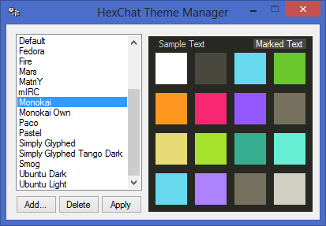

Appearance
==========

Theme Manager
-------------

We distribute themes as :file:`.hct` files. These are just simply ZIP archives that you can extract manually and install into your `config folder <settings.html#config-files>`_. Some themes can be found `here <http://dl.hexchat.net/themes/>`_.

The theme manager is a simple external application, which is included with the `installer <http://hexchat.net/downloads.html>`_ on Windows and `buildable <building.html#building-theme-manager>`_ on Unix, that helps install themes.

.. note::
	.NET 4 is required to run the theme manager; You can download it from `Microsoft's site <http://www.microsoft.com/en-us/download/details.aspx?id=17113>`_.

Theming
-------

Colors
~~~~~~

Colors are defined in :menuselection:`Settings --> Preferences --> Colors`. Text Colors set the palette for events to use. The rest like background color directly affect parts of the UI.

`mIRC <http://www.mirc.com/colors.html>`_ colors (0-15) are what you refer to when sending colored text over IRC for others to see and vice versa, because of this they should somewhat follow a set of standards so clients can agree 4 is red.

Local colors (16-31) are to be used by HexChat only and can be anything you wish, these are typically what you use in your `events <appearance.html#text-events>`_.

Text Events
~~~~~~~~~~~

Text events control the look of every event you see. They can be customized in :menuselection:`Settings --> Text Events` using these codes to format it:

- **%C<fg>,<bg>** Color code
- **%R** Reverse color
- **%U** Underlined text
- **%B** Bold text
- **%I** Italic text (2.10.0+)
- **%H** Hide text
- **%O** Normal text
- **$t** Text separator
- **$aXXX** Ascii value
- **$<num>** Event information

.. note::
	Always hit enter after editing a field.

Icons
~~~~~

HexChat comes with built in icons for the tray, user list, and channel tree (which can be disabled in Preferences). You can use `custom icons <http://dl.hexchat.net/themes/icons/>`_ by placing icons (16x16 recommended) in an :file:`icons` subdir, which may need to be created, within your `config folder <settings.html#config-files>`_. The icons must be named as follows:

- User List

  - ulist_netop.png
  - ulist_founder.png
  - ulist_owner.png
  - ulist_op.png
  - ulist_halfop.png
  - ulist_voice.png

- Channel Tree

  - tree_channel.png
  - tree_dialog.png
  - tree_server.png
  - tree_util.png

- Tray Icon

  - tray_fileoffer.png
  - tray_highlight.png
  - tray_message.png
  - hexchat.png

Gtk Theme
~~~~~~~~~

To customize more than just text color such as the window borders you must install a gtk theme.

You can place a *gtkrc* file in *<installdir>\\etc\\gtk-2.0* or save it as *%USERPROFILE%\\.gtkrc-2.0*

The latter will not be overwritten ever but will affect all gtk applications. Eitherway you **must**
make sure during installation to uncheck *Gtk Theme* to not overwrite the global theme or mess up the user theme.

As of 2.9.7 we ship the Pixbuf/Pixmap theming engine on Windows required by many custom themes, 2.9.6 does not so themes may not look correct.

Buttons, Menus, and Popups
--------------------------

Userlist Popup
~~~~~~~~~~~~~~

Popups are shown when you right click on a nickname, either in the userlist or in the main chat itself. These can be edited in :menuselection:`Settings --> Userlist Popup`

The Name column can take either just the name of the entry, *SUB*/*ENDSUB* for submenus, *SEP* for separators, and *TOGGLE* for toggleable options.
Suffix the name with *~GTK_ICON_NAME~* to show an icon (see `Gtk Stock Items <https://developer.gnome.org/gtk2/stable/gtk2-Stock-Items.html>`_) and prefix a character with *_* for keyboard shortcuts (e.g. N_ame will bind a).

The Command column can take any `command <commands.html>`_ with text formatted using the same codes as `text events <appearance.html#text-events>`_ and on top of that they also have their own codes:

- **%a** all selected nicks
- **%c** current channel
- **%h** selected nick's hostname
- **%m** machine info
- **%n** your nickname
- **%s** selected nickname
- **%t** time/date
- **%u** selected nick's account (2.9.6+)

As a sidenote the **gui_ulist_doubleclick** setting can run a command using these codes when double-clicking a nick in the userlist.

Userlist Buttons
~~~~~~~~~~~~~~~~

Buttons are shown below the userlist, can be edited in :menuselection:`Settings --> Userlist Buttons`, and take the same syntax as `Userlist Popup <appearance.html#userlist-popup>`_ for commands.

Usermenu
~~~~~~~~

In order to add custom entries to your menu you need to first enable the usermenu with the command :command:`/set gui_usermenu on` which may require a restart. Once this is enabled you can go to :menuselection:`Usermenu --> Edit this Menu` to add any `command <commands.html>`_  you would like. For menu entries it supports the same as `Userlist Popups <appearance.html#userlist-popup>`_.
