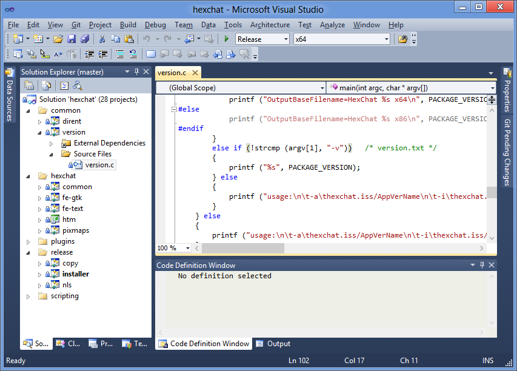

Building
========

Windows
-------

Software
~~~~~~~~

Download and install (in their default install paths):

-  `Visual Studio 2010 Professional
   Trial <http://www.microsoft.com/en-us/download/details.aspx?id=16057>`_
-  `Inno Setup 5.5 Unicode <http://www.jrsoftware.org/isdl.php>`_
-  `ISSkin 3 <http://isskin.codejock.com/>`_
-  `7-Zip x64 <http://7-zip.org/>`_
-  `gendef <https://github.com/downloads/hexchat/hexchat/gendef-20111031.7z>`_
   (extract to *c:\\mozilla-build*)
-  `msgfmt <https://github.com/downloads/hexchat/hexchat/msgfmt-0.18.1.7z>`_ (extract
   to \ *c:\\mozilla-build*) 

Source code
~~~~~~~~~~~

Download the `HexChat source
code <https://github.com/hexchat/hexchat/zipball/master>`_ and extract
it to somewhere. You will work in the extracted *hexchat* folder from
now.

GTK+
~~~~

Create a folder for GTK+, referred to as *YourDepsPath* from now.
Specify the absolute path to *YourDepsPath* in *win32\\hexchat.props*
with the *YourDepsPath* property. Download:

-  `GTK+ x86
   bundle <https://github.com/downloads/hexchat/gtk-win32/gtk-x86.7z>`_
-  `GTK+ x64
   bundle <https://github.com/downloads/hexchat/gtk-win32/gtk-x64.7z>`_

Extract them to *YourDepsPath*. After that, your deps folder should look
like
`this <http://www.hexchat.org/developers/building/deps.png?attredirects=0>`_.

Language interfaces
~~~~~~~~~~~~~~~~~~~

You can skip this step, but then you won't be able to generate the
installer.
Download:

-  `Perl 5.16
   x86 <https://github.com/downloads/hexchat/hexchat/perl-5.16.2-x86.7z>`_
   (extract to *c:\\mozilla-build\\perl-5.16\\Win32*)
-  `Python <http://www.python.org/download/>`_ 2.7 x86 (install to
   *c:\\mozilla-build\\python-2.7\\Win32*)

-  `Perl 5.16
   x64 <https://github.com/downloads/hexchat/hexchat/perl-5.16.2-x64.7z>`_
   (extract to *c:\\mozilla-build\\perl-5.16\\x64*)
-  `Python <http://www.python.org/download/>`_ 2.7 x64 (install to
   *c:\\mozilla-build\\python-2.7\\x64*)

You can use other paths, but then you must update the related properties
in *win32\\hexchat.props* accordingly.

Building
~~~~~~~~

Open *win32\\hexchat.sln*, right click on the *release/installer* (or
*release/copy* if you skipped the language interfaces) project and set
it as the startup project. Now you can compile from under the *Build*
menu to your taste.

If everything went fine, the resulting binaries will be found in
*hexchat-build\\Win32* and/or *hexchat-build\\x64*. It was easy, wasn't
it?

Unix
-----

First of all, you have to install the build dependencies just like you
would for an XChat compilation. Package names differ across distros, so
be creative and check your *configure* output if you get an error.

HexChat has its source code hosted in Git, so you have to install Git as
well. When it's ready, you can start the actual compilation, which is
basically:

.. code-block:: none 

 git clone https://github.com/hexchat/hexchat.git 
 cd hexchat 
 ./autogen.sh 
 ./configure make 
 ./src/fe-gtk/hexchat

This will compile with defaults. See *./configure --help* for more info
about flags.

Mac
-----

Install `Homebrew <http://mxcl.github.com/homebrew/>`_, then install all
the build dependencies of HexChat such as GTK+. Be creative and check
your *configure* output if you get an error.

Download the `testing
package <https://github.com/downloads/hexchat/hexchat/hexchat-mac.tar.gz>`_
which is prepared for Homebrew compilation (basically a clone of Git
HEAD with *./autogen.sh* ran on Debian 6). Extract it and run the
following commands:

.. code-block:: none

 cd hexchat 
 ./configure --disable-nls --disable-xlib --disable-perl make 
 ./src/fe-gtk/hexchat 

See *./configure --help* for more info about flags.