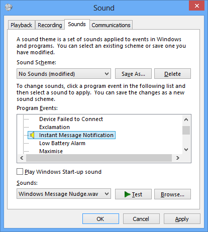
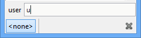
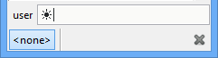

Frequently Asked Questions
==========================

How do I migrate my settings from XChat?
----------------------------------------

It is recommend to just start with fresh settings as the format and names of
many options have changed and you may encounter some oddities migrating.

- Unix

  1. Copy ``~/.xchat2`` to ``~/.config/hexchat``
  2. Rename ``~/.config/hexchat/xchat.conf`` to ``~/.config/hexchat/hexchat.conf``
  3. Rename ``~/.config/hexchat/servlist_.conf`` to ``~/.config/hexchat/servlist.conf``
  4. Rename ``~/.config/hexchat/xchatlogs`` to ``~/.config/hexchat/logs``
  5. Move all your 3rd party addons (plugins/scripts) to ``~/.config/hexchat/addons``
  6. Move all your client certs to ``~/.config/hexchat/certs``

- Windows

  1. Copy ``%APPDATA%\X-Chat 2`` to ``%APPDATA%\HexChat``
  2. Rename ``%APPDATA%\HexChat\xchat.conf`` to ``%APPDATA%\HexChat\hexchat.conf``
  3. Rename ``%APPDATA%\HexChat\servlist_.conf`` to ``%APPDATA%\HexChat\servlist.conf``
  4. Rename ``%APPDATA%\HexChat\xchatlogs`` to ``%APPDATA%\HexChat\logs``
  5. Move all your 3rd party addons (plugins/scripts) to ``%APPDATA%\HexChat\addons``
  6. Move all your client certs to ``%APPDATA%\HexChat\certs``

The server list format also changed, instead of a giant autojoin list formatted ``J=chan1,chan2 key1,key2``
it is now formatted on seperate lines ``J=chan1,key1\nJ=chan2,key2``

How do I autoconnect and join a channel on start?
--------------------------------------------------

In the Network List, select the network to which you would like to automatically connect to at startup,
click the "Edit..." button, and then tick the checkbox for "Connect to this network automatically".

To automatically join channels for this network upon connecting, select the "Autojoin channels"
tab in this same window and add your desired channels here. You can also add a currently joined channel
by right-clicking its name in the channel switcher and by toggling "Autojoin" on.

How do I auto-reconnect after my computer wakes up from being in sleep/hibernate mode?
--------------------------------------------------------------------------------------

Try the following command from a chat window (time is in seconds):

    /set net_ping_timeout 60

Why are channels joined before identifying?
-------------------------------------------

There are 3 ways to authenticate before joining a channel, all are network dependant but nickserv is common:

1. Use a Nickserv password and increase the delay before joining in :menuselection:`Settings --> Preferences --> Advanced`

2. Use SASL which can be enabled in :menuselection:`HexChat --> Network list --> Edit` (2.9.4+).
   Your username must match your nickserv account, you can set it by unchecking *Use global user information*.

3. Use a `client cert <tips.html#client-certificates>`_ which requires the most setup.

How do I change what browser is opened?
---------------------------------------

- Windows:

  :menuselection:`Control Panel --> Default Programs`

- Unix:

  - Gnome 3: :menuselection:`System Settings --> Details --> Default Applications`
  - Other DE's have their own settings that may or may not work.

  If these do not work or you do not use a DE use the command :command:`gvfs-mime` which may need to be installed::

      gvfs-mime --set x-scheme-handler/http firefox.desktop

  Don't forget to do the same for *https* and run this as your user.

  Now upon launching it will use the *Exec* line in their desktop file replacing *%u* with the url.
  If you get a blank window this is where the problem is.

Alternatively you can add a `Url Handler <settings.html#url-handlers>`_

How do I connect through a proxy?
---------------------------------

Go to the menus, :menuselection:`Settings --> Preferences --> Network Setup`
and fill in the requested information there. Authentication (using a
username and password) is only supported for HTTP and Socks5.

For information on Tor see our `tips page <tips.html#tor>`_

How do I show @ and + in front of nicknames that are Op and Voice when they talk?
---------------------------------------------------------------------------------

To display @ and + characters next to nicknames as they talk, do the
following:

In the menus, open up :menuselection:`Settings --> Text Events`. Find the *Channel
Message* event in the list. The $3 code can be inserted to print the
user's mode-character (e.g. @ or +). For example, you might want to
change the default:

    %C18%H<%H$4$1%H>%H%O$t$2

to

    %C18%H<%H$4$3$1%H>%H%O$t$2

Don't forget to **press Enter**, so the changes take effect in the list
at the top of the window.

How do I set different ban types?
---------------------------------

1. Right click the nickname in the userlist, and choose a ban type from
   the "Kick/Ban" submenu.

2. You can also do it manually: > /ban nick bantype where the bantype is
   a number from 0 to 3.
3. Or set the default with:

   /set irc\_ban\_type bantype sets the default ban type to use for
   all bans. The different types are:

   - 0 = \*!\ *@*.host
   - 1 = \*!\*\@domain
   - 2 = \*!\ *user\@*.host
   - 3 = \*!\*user\@domain

Why does the timestamp overlap some nicknames?
----------------------------------------------

Some networks allow very long nicknames (up to 32 letters). It can be
annoying to have the separator bar move too far to the right, just for
one long nick. Therefore, it has a set limit for the distance it will
move to the right. If you use a large font, you may need to adjust this
distance. It is set in pixels, for example:

    /set text\_max\_indent 320

Once you adjust this setting high enough, overlapping timestamps and
nicknames should not occur. The adjustment will not take effect
immediately, a restart may be needed.

How do I hide join and part messages?
-------------------------------------

To disable joins and parts from being displayed in all channels check 'Hide join and part messages' under
:menuselection:`Settings -> Preferences -> Chatting -> General` (Advanced pre-2.9.6)'.

Then all channels you join **after** setting this will start with "Show
join/part messages" turned off.

To disable the prints for only certain channels, right click on the channel tab and click
:menuselection:`Settings -> Hide Join/Part Messages`

Why doesn't DCC send work behind a router?
------------------------------------------

If you are behind a IP-NAT or ADSL router, you will most likely have an
address like 192.168.0.1. This address is not usable on the Internet,
and must be translated.

When offering a DCC file, HexChat will tell the receiver your address.
If it says 192.168.0.1, the receiver will not be able to connect. One
way to make it send your "real" address is to enable the "Get my IP from
IRC Server" option in HexChat. This option is available in :menuselection:`Settings --> Preferences -->
Network setup`. When you turn it ON, you will have to re-login
to the server before it'll take effect.

You will also need to forward some ports for use in DCC send. You may
pick almost any port range you wish, for example, in HexChat set:

First DCC send port: 4990
Last DCC send port: 5000

This will allow you to send up to ten files at the same time, which
should be plenty for most people. Lastly, configure your router/modem to
forward ports 4990-5000 to your PC's address. You'll have to consult
your router/modem's manual on how to do this.

How do I execute multiple commands in one line?
-----------------------------------------------

There are a few ways to do this:

- If this is during connection the network list (Ctrl+s) has a 'connect commands'
  section as well as most login types you would need.

- /LOAD -e <textfile>, where <textfile> is a file in your config dir
  containing commands on each line.

- Separate your commands with CTRL-SHIFT-u-a. This will appear as a
  little box with numbers on it (or an invisible character).

- You can create two UserCommands, with the same name, and then execute
  the UserCommand. It will be executed in the same order as it's
  written in the UserCommands GUI.

I get this error: "Unknown file type abc.yz. Maybe you need to install the Perl or Python plugin?"
--------------------------------------------------------------------------------------------------

If you get this error when trying to load a Perl or Python script, it
means the plugin or language for running those scripts isn't loaded.

On Unix:
- Install the packages including these plugins (i.e. hexchat-perl) and perl.
- When building yourself check ./configure output and install devel packages.

On Windows
- Select the plugins in the installer.
- Install the language linked on our downloads page.

How do I play sound files on certain events?
--------------------------------------------

In the menus, go to: :menuselection:`Settings --> Preferences --> Sound`.
Select the event you want to make a sound on, then type in a sound
filename (or use the Browse button). On Windows, sound files must be in .wav format.

How do I auto-load scripts at startup?
--------------------------------------

The root of your HexChat config is:

-  Windows: %APPDATA%\\HexChat
-  Unix/Linux: ~/.config/hexchat

Referred to as <config> from now. HexChat automatically loads, at
startup:

-  <config>/addons/\*.pl Perl scripts
-  <config>/addons/\*.py Python scripts
-  <config>/addons/\*.dll Plugins (Windows)
-  <config>/addons/\*.so Plugins (Unix)

How do I minimize HexChat to the System Tray (Notification Area)?
-----------------------------------------------------------------

On both Unix and Windows there is an included tray plugin. To enable
minimizing to tray on exit go to :menuselection:`Settings --> Preferences --> Alerts`.

How do I start HexChat with...?
-------------------------------

To see the various launch options such as setting configdir or minimize level run:

    hexchat --help

Where are the log files saved to?
---------------------------------

- Unix

    ~/.config/hexchat/logs

- Windows

    %APPDATA%\\HexChat\\logs

How do I rotate log files every so often?
-----------------------------------------

By default settings, no rotation occurs, your log files will just keep
getting larger.

Go to :menuselection:`Settings --> Preferences --> Logging` and change the
log filename to any one of these:

    %Y-%m-%d/%n-%c.log -> 2006-12-30/FreeNode-#channel.log

    %n/%Y-%m-%d/%c.log -> FreeNode/2006-12-30/#channel.log

    %n/%c.log -> FreeNode/#channel.log (no rotation)

%Y, %m and %d represents the current year, month and day respectively.
%n is the network name, e.g. "FreeNode" or "UnderNet", and finally, %c
is the channel. In these examples, a new log filename and folder would
be created after midnight.

The format can also be a full path if you want to save logs to an external drive for example.

For the full list of formatting codes, please refer to the
`Unix <http://linux.die.net/man/3/strftime>`_ or
`Windows <http://msdn.microsoft.com/en-us/library/fe06s4ak(v=vs.110).aspx#languageReferenceRemarksToggle>`_
documentation on `strftime`.

Where did the Real Name field go?
---------------------------------

The Real name field used to be accessible via the Network List, which is the
very first screen that a new user sees. Newcomers, who are not familiar with
IRC terminology, might be afraid of their personal data. In order to avoid
alienating such people, we decided to remove this setting from the Network
List. Now you can access this setting under :menuselection:`Settings -->
Preferences --> Advanced` instead, or if you prefer the command line, you can
use the following command:

    /set irc\_real\_name Stewie Griffin

Why don't beep sound alerts work?
---------------------------------

On Windows, HexChat is using the `Instant Message Notification` system sound
for making beep alerts, and if it's unspecified, it attempts to produce a
simple beep effect. In case you don't hear beeps when alerts occur, you need
to set this system sound to the desired sound effect. To do this, go to
:menuselection:`Control Panel --> Hardware and Sound --> Change system sounds`.

On Unix it uses libcanberra by default to play the "message-new-instant" freedesktop sound.
Use the *canberra-gtk-play* command to test playing events or custom sound files
as that is likely where the problem lies.

How do I type Unicode characters?
---------------------------------
Press `Ctrl + Shift + U` at once. When you release the keys, `u` will appear in
your input box.

Now you can enter the 4-digit code of the desired glyph. When you're done, just
press `Space` or `Return`, and the glyph will appear as well.

.. Note:: Windows alt codes will not work.

How do I add a network to the official list?
--------------------------------------------

There are no official requirements to be added to the network list,
but there are some simple guidelines of what the network SHOULD have.

- A maintained website listing servers.
- Has been around for a while.
- A decent amount of active users (100+).
- Doesn't block large groups of users.

You should make a pull request on `GitHub <https://github.com/hexchat/hexchat/pulls>`_ if you
want the quickest results, the list is stored in *src/common/servlist.c*. You should include an
SSL server if supported but you should not include IPv6 only servers and mark SASL as default if supported.
Follow the syntax of other networks in the file.
