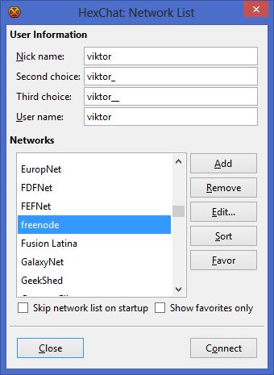
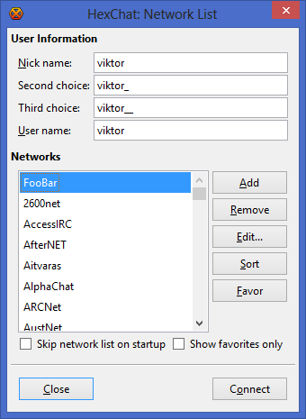
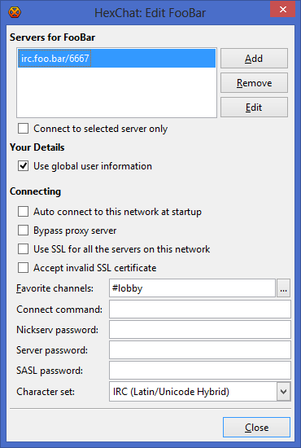
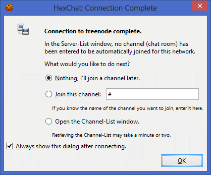
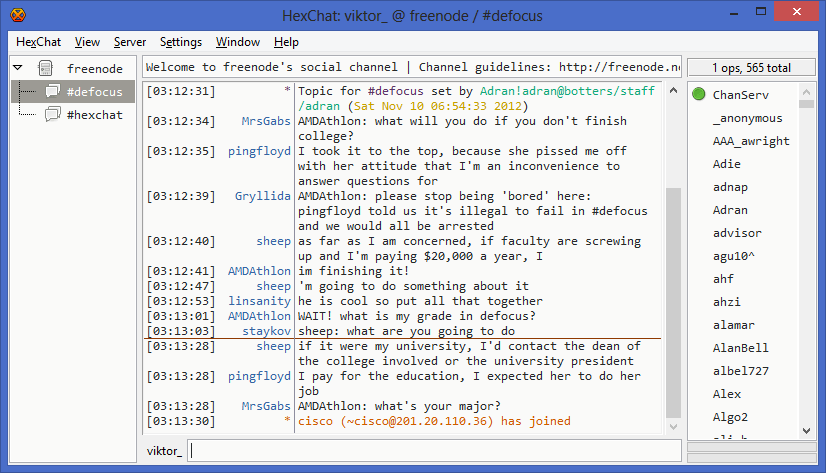

Getting Started
===============

Quick Start
-----------

The first time you start HexChat you'll see the *Network List* as seen
below:

Here you can specify your global logon details. The *Nick name* will be
your name visible in IRC channels (or second/third choice if it's
already taken), and the *User name* is how you identify yourself to the
server.
You can pick a server from the default list, or if it's not there, you
can add your own by clicking the *Add* button:

After you named it, click *Edit...* and specify the details of your
connection. You need at least the following information to join to a
certain group of people:

- server address
- server port
- channel name

You can see an example below:

In this example, the server address is *irc.foo.bar* and the port
is *6667*. The channel of choice is *#lobby*. Favorite channels are
joined to automatically upon connecting to the network. After you
finished editing, click *Close* to return to the *Network List*.
Now select the network you want to connect to and click *Connect*. After
a successful connection you'll see the following window:

If you don't want to join a channel just yet, leave it as it is. If you
know the channel name already, specify it with the second option. In
case you want to browse through the channel list, select the third
option. Then press *OK* to close this window.
After you successfully joined a channel, you should see something like
this:

That's it, you're online. Now you can learn more about HexChat and
customize it for your needs. This website is a good starting point, but
you can find a lot more on the net. Have fun!

Frequently Asked Questions
--------------------------

.. toctree::
    :maxdepth: 2

    faq

Changelog
---------

.. toctree::
    :maxdepth: 2

    changelog
