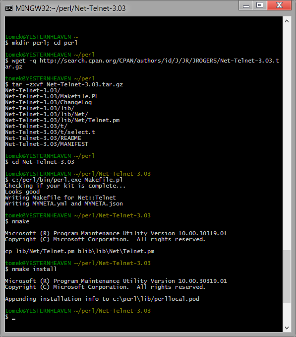

Building Perl modules on Windows
================================

CPAN
----

Software
--------

- `Visual Studio 2012 Express for Windows Desktop`_ + `Visual Studio 2012 Update 3`_
- Perl `x86`_ or `x64`_
- `MSYS`_ (I'm linking to this version but you can use ANY MSYS, it's possible to use MSYS from MozillaBuild but it's really ancient)
- This `script <https://gist.github.com/tomek/6345568>`_

.. _MSYS: http://xhmikosr.1f0.de/tools/

Setup
-----

You must paste my script to directory above your Perl installation. Script was written for Perl installed in MozillaBuild directory: C:\\mozilla-build\\perl-5.18\\x64 or \\x86, so script must be in perl-5.18 dir, if your Perl installation dir is in another place you must edit PATHs in lines 13 & 16.

MSYS can be extracted to any directory you want, you just need to edit PATH in *SET MSYS=I:\\MSYS\\bin*, fg. *SET MSYS=C:\\MSYS\\bin*

Usage
-----

To use script you must open cmd (Win+R, type cmd), navigate to directory where you pasted cpan.bat. Type *cpan.bat x86* if you're using 32bit Hexchat & Perl or *cpan.bat x64* for 64bit version. After that you can use all cpan commands.

Old depreciated method
----------------------

Software
--------

To start building Perl modules you need to download and install this software (in their default install paths):

- `MozillaBuild`_ or `direct link`_
- `Visual Studio 2012 Express for Windows Desktop`_ + `Visual Studio 2012 Update 3`_
- Perl `x86`_ or `x64`_ (Perl **MUST** be installed to C:\\Perl)

.. _MozillaBuild: https://wiki.mozilla.org/MozillaBuild
.. _direct link: http://ftp.mozilla.org/pub/mozilla.org/mozilla/libraries/win32/MozillaBuildSetup-Latest.exe
.. _Visual Studio 2012 Express for Windows Desktop: http://www.microsoft.com/visualstudio/eng/downloads#d-express-windows-desktop
.. _Visual Studio 2012 Update 3: http://www.microsoft.com/en-us/download/details.aspx?id=39305
.. _x86: http://dl.hexchat.org/misc/perl/perl-5.18.0-x86.7z
.. _x64: http://dl.hexchat.org/misc/perl/perl-5.18.0-x64.7z

Downloading and Extracting
--------------------------

Start MozillaBuild console (it's in C:\\mozilla-build) *start-msvc11.bat* (if you're using Hexchat x86) or *start-msvc11-x64.bat* (if you're using Hexchat x64).

Type:

.. code-block:: none

    mkdir perl; cd perl

(we will work in *perl* directory).

All Perl modules can be downloaded from `CPAN`_ site.

.. _CPAN: http://search.cpan.org/

Now we can download the module which can be done using *wget http://link* command.
Later we extract it using *tar -zxvf module.tar.gz*.

In this guide we will build Net::Telnet module. So we are downloading it and extracting:

.. code-block:: none

    wget http://search.cpan.org/CPAN/authors/id/J/JR/JROGERS/Net-Telnet-3.03.tar.gz
    tar -zxvf Net-Telnet-3.03.tar.gz

Type *cd Net-Telnet-3.03* and we can start building.

Note on Perl module dependencies
--------------------------------

This building method isn't perfect so if you're building modue which depends on other module, you need to build it before repeating all steps in this guide.

Building
--------

Fist thing we must do is to configure module and point it to our Perl installation using:

.. code-block:: none

    c:/perl/bin/perl.exe Makefile.pl

Note: It really depends if it is Makefile.pl or Build.pl, just check in folder and read README.

You should get something like this:

.. code-block:: none

    Checking if your kit is complete...
    Looks good
    Writing Makefile for Net::Telnet
    Writing MYMETA.yml and MYMETA.json

It means that module was properly configured. Now we can move to compilation which can be done using:

.. code-block:: none

    nmake

After it we can install module using:

.. code-block:: none

    nmake install

Now if you didn't get any error you should have Perl module installed and it can be used with Perl script in Hexchat.

Whole operation should look like this:

