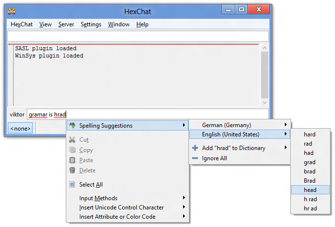

Tips & Tricks
=============

Spell Check
-----------

Windows
~~~~~~~

HexChat for Windows uses MySpell for spelling via the Enchant library. The required libraries are included in the installer, but the dictionaries are big so they are distributed in a separate archive. They're from Debian Lenny.

If you want to have spelling, do the following:

1. Download the `Spelling Dictionaries <http://hexchat.github.io/downloads.html>`_ self-extracting archive
2. Specify the languages you wish to have spelling for in :menuselection:`Settings --> Preferences --> Interface --> Input box`. You need to specify their language codes, see :file:`%LOCALAPPDATA%\\enchant\\myspell` for hints. By default, HexChat uses the LC_ALL environmental variable, or if it's unset, it falls back to en_US.

.. note::

    For portable installs, you can use the :file:`share\\myspell\\dicts` subfolder instead of :file:`%LOCALAPPDATA%\\enchant\\myspell` (both will work, but the former one can be carried on a pendrive unlike the latter one).

Unix
~~~~

Install your spelling dictionaries via your package manager (myspell-en-us on the Debians or hunspell-en-US everywhere else for English). Then make sure to enable spelling under :menuselection:`Settings --> Preferences --> Interface --> Input box`.

In 2.10.0+ you can then list your languages in :menuselection:`Settings --> Preferences --> Interface --> Input box` by their language codes (i.e. de_DE for german), separated by commas.

In older versions the language can be overriden by starting HexChat with "*LANG=en_US hexchat*" (You can edit your hexchat.desktop file to do this every launch)

Localization
------------

In order to start HexChat in a different language (for which a translation exists `here <https://www.transifex.com/projects/p/hexchat/>`_) you can use the regional settings of Windows, or set the LC_ALL user environmental variable. The value of the variable must be the two letter country code for your country. If in doubt, have a look at the share\locale folder. You have to restart HexChat for the changes to apply.

You can also use a batch file to affect only HexChat:

.. code-block:: bat

    @echo off
    set LC_ALL=en
    start hexchat.exe

This sets the language to English. You may use *fr* for French, *de* for German, etc. Save the code above as :file:`run.bat`, and copy it to the HexChat install folder. You can then start HexChat in the desired language by running the batch file.

Special Glyphs
--------------

There are many symbols which may not be supported by the main font you selected to use in HexChat, especially Asian glyphs and special characters, like a peace sign. In this case, you'll see "lego blocks" instead of them.

To circumvent this, you need to have alternative fonts for glyphs not supported by your current font. On Unix this is handled automatically. On Windows you can specify them in :menuselection:`Settings --> Preferences --> Chatting --> Advanced --> Alternative fonts`. By default, it is set to *Arial Unicode MS,Segoe UI Emoji,Lucida Sans Unicode,Meiryo,Symbola,Unifont*, which should cover most characters (note that Unifont does not come with Windows).

There are many available fonts that try to cover most of unicode:

- `Unifont <http://unifoundry.com/unifont.html>`_
- `Symbola <http://users.teilar.gr/~g1951d/>`_
- `Quivira <http://www.quivira-font.com/>`_

In case you still get lego blocks, you'll need to add additional fonts to the list which support those obscure glyphs. Feel free to extend the list. You only need to specify font names, other info (such as size, weight, style etc.) should be omitted, otherwise those entries will be ignored. All font names must be separated by a comma and there mustn't be spaces before and/or after commas.

Please bear in mind that for some reason certain fonts that can display a certain glyph when used as the main font may not work when specified as an alternative font so you might have to play around it a bit.

Client Certificates
-------------------

Client Certificates allows you to identify to networks services using a certificate. Please do not mistake it for server certificate which allows you to connect to network with invalid certificate, right now HexChat can't do it.

To use one you need to put your certificate file inside :file:`certs` directory in HexChat's `config folder <settings.html#config-files>`_.

Certificate should be named after the network where it will be used, for example if you want to use it on *Rizon*, certificate file should look like this: *Rizon.pem*. If that does not exist every network will try *client.pem*. It can not be encrypted and require a password.

On networks that support it you can use SASL EXTERNAL in the network list. If a network does not support this but does support normal SASL such as freenode usually that would be the better option.

Note on Custom Server Certificates
~~~~~~~~~~~~~~~~~~~~~~~~~~~~~~~~~~

On Windows it is possible to edit *cert.pem* file in HexChat main installation directory and add custom certificate there. But this method isn't very effective as *cert.pem* is overwritten each time HexChat installer is used.

Notice Placement
----------------

Other than channel messages and private messages, IRC has a notice type of message. This is intended to be used as a reply, something that will not cause the other client to send any acknowledgement back. When HexChat displays these messages, it shows them in a tab that it figures is appropriate.

Why replies from ChanServ may not appear in the current tab
~~~~~~~~~~~~~~~~~~~~~~~~~~~~~~~~~~~~~~~~~~~~~~~~~~~~~~~~~~~

When HexChat decides where to print a notice, it does so in the following order:

1. In a query window you have with that user
2. In the front tab, if the tab is a channel, the other user is on that channel, and you are on the correct network
3. In the last joined channel you have in common with the other user
4. The current tab, if you are on the same network
5. The last tab you looked at that shares the correct network with the other user

This means that if you issue a :command:`/cs info #yourchannel` from your channel, the reply may show up elsewhere if ChanServ isn't in your channel, but is in some other channel.

How to make notices show up in a consistent location
~~~~~~~~~~~~~~~~~~~~~~~~~~~~~~~~~~~~~~~~~~~~~~~~~~~~

The simplest method is to set the location in :menuselection:`Settings --> Preferences --> Channel switcher --> Placement of notices`, and select "in an extra tab" or "in the front tab". The former will cause all server notices to go into a (snotices) tab, and all user notices to go into a (notices) tab. The latter will always print the notices where you are, this can cause odd positioning of channel notices but you will never miss them.

If you know who will notice you before hand, you can simply query the user before they notice you. This way, all notices from that user will show up in the query tab. In the case of ChanServ, this may allow an easier archive of commands you have done anyway.

For other locations, a separate script would be required. While not currently implemented, it would be possible with a script to treat all notices like private messages (open a new query window when received), or place them in a specific existing tab, such as the server tab. At this point, the choice is up to you (or whoever designs the script).

How the marker line works
-------------------------

The marker line is a very useful tool to keep track of what you have and have not read in a channel but it's behavior is non-obvious at times. It just follows a few simple rules though.

A line is created when new information is printed in a context that is not currently visible. This means the window is in the background, another tab is selected, or you are scrolled up.

This line by design only automatically resets when it is seen. One common issue here is that the marker line is at the very top of your scrollback so you very unlikely to see it. This can happen with bnc playback for example where you get a lot of messages at once.

HexChat has two shortcuts to reset the marker line also. Ctrl+M will reset the the marker line directly. Ctrl+Shift+M will scroll to where the marker was which is quite useful if you actually care about the scrollback.

Once a marker line is "reset" it does not instantly get created at the bottom it will only be created if it matches the conditions mentioned above (not being visible).

Tor
---

1. Find a network that allows tor (most don't). Example: `freenode`_ (NOTE: Freenode has removed tor support)
2. Get tor working. Refer to the tutorial from official tor website (instructions for `Windows <http://www.torproject.org.in/docs/tor-doc-windows.html.en>`_ and `Linux <http://www.torproject.org.in/docs/debian.html.en>`_). For windows -  Browser bundle is an easy way to test.
3. Set up proxy in :menuselection:`Settings --> Preferences --> Network Setup`. Example (with defaults):

4. Setup the network in :menuselection:`HexChat --> Network List`. Note the ip from `freenode`_'s site (which may change) and for freenode SASL is required. Example:

.. _freenode: http://freenode.net/irc_servers.shtml#tor

Twitch
------

Twitch.tv uses irc for chat so you can use a regular client for chat but it is a very customized irc that has some extra requirements.

In the Network List add a new network and for the server use *irc.chat.twitch.tv* with SSL. You must have your nickname match your twitch account. For the login method choose *Server Password* and generate a password on this website `<http://twitchapps.com/tmi>`_

To enhance your experience I recommend using the `twitch.py <https://github.com/TingPing/plugins/blob/master/HexChat/twitch.py>`_ script.
